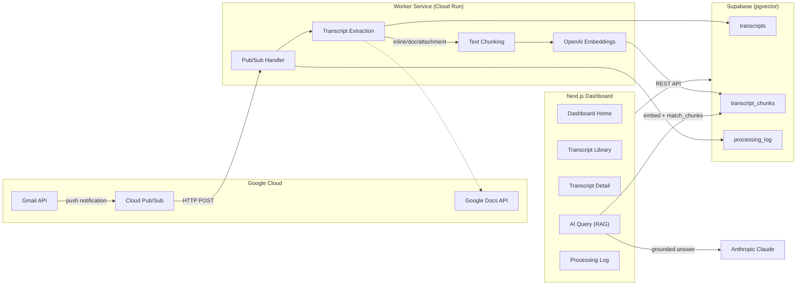

# MeetScript — Google Meet Transcript Pipeline

A full-stack application that monitors your Gmail for Google Meet transcript emails, extracts and vectorizes the content, and provides a conversational RAG dashboard for querying your meeting history.

**Built by [3rd AI LLC](https://3rdai.co)** · `solutions@3rdaillc.com`

## Architecture



## Project Structure

```
meet-transcript-pipeline/
├── apps/
│   ├── web/                  # Next.js 14 dashboard (App Router)
│   │   ├── app/              # Pages + API routes
│   │   ├── components/       # Sidebar, UI components
│   │   └── lib/              # Supabase client, API wrappers
│   └── worker/               # Gmail listener service
│       ├── src/
│       │   ├── gmail/        # Gmail API + Pub/Sub handler
│       │   ├── extraction/   # Transcript parsing (3 formats)
│       │   ├── chunking/     # Text chunking logic
│       │   ├── embedding/    # OpenAI embedding calls
│       │   └── db/           # Supabase client + queries
│       └── Dockerfile
├── packages/
│   └── shared/               # Shared TypeScript interfaces
├── supabase/
│   └── migrations/           # SQL migration files
├── .env.example
├── turbo.json
└── package.json
```

## Getting Started in 5 Minutes

### Prerequisites

- **Node.js 20+** and **npm 10+**
- A **Google Cloud** project with Gmail API, Docs API, Drive API, and Pub/Sub enabled
- A **Supabase** project with the `pgvector` extension
- API keys for **OpenAI** (embeddings) and **Anthropic** (RAG answers)

### 1. Clone and install

```bash
git clone <repo-url>
cd meet-transcript-pipeline
npm install
```

### 2. Configure environment

```bash
cp .env.example .env
# Fill in all values — see .env.example for descriptions
```

### 3. Set up the database

Run the migration in your Supabase SQL Editor or via the CLI:

```bash
# Via Supabase CLI
supabase db push
# Or paste the contents of supabase/migrations/001_create_tables.sql
# into the Supabase SQL Editor
```

### 4. Set up Gmail Pub/Sub

```bash
# Create a Pub/Sub topic
gcloud pubsub topics create gmail-notifications

# Grant Gmail permission to publish
gcloud pubsub topics add-iam-policy-binding gmail-notifications \
  --member="serviceAccount:gmail-api-push@system.gserviceaccount.com" \
  --role="roles/pubsub.publisher"

# Create a push subscription pointing to your worker
gcloud pubsub subscriptions create gmail-worker-sub \
  --topic=gmail-notifications \
  --push-endpoint=https://YOUR_WORKER_URL/pubsub
```

### 5. Start development

```bash
npm run dev
```

This starts both the worker (port 3001) and the Next.js dashboard (port 3000) via Turborepo.

## Deployment

### Worker → Cloud Run

```bash
cd apps/worker

# Build and push
docker build -t gcr.io/YOUR_PROJECT/meet-worker -f Dockerfile ../..
docker push gcr.io/YOUR_PROJECT/meet-worker

# Deploy
gcloud run deploy meet-worker \
  --image gcr.io/YOUR_PROJECT/meet-worker \
  --platform managed \
  --region us-central1 \
  --set-env-vars "$(cat ../../.env | tr '\n' ',')"
```

### Frontend → Vercel or Cloud Run

```bash
# Vercel (recommended)
cd apps/web
npx vercel --prod

# Or Cloud Run
docker build -t gcr.io/YOUR_PROJECT/meet-web .
gcloud run deploy meet-web --image gcr.io/YOUR_PROJECT/meet-web
```

## Testing

```bash
# Run all worker tests
npm run test --workspace=apps/worker

# Run specific test suites
cd apps/worker
npx vitest run src/__tests__/extraction.test.ts
npx vitest run src/__tests__/chunker.test.ts
npx vitest run src/__tests__/filters.test.ts
npx vitest run src/__tests__/normalize.test.ts
```

## Transcript Extraction Formats

| Format | Detection | Processing |
|--------|-----------|------------|
| **Inline HTML** | Transcript in email body | Strip HTML, preserve speakers/timestamps |
| **Google Doc** | Link to `/document/d/ID/` | Export as plain text via Drive API |
| **Attachment** | `.txt`, `.vtt`, `.sbv` file | Download and strip timecodes/cues |

## Tech Stack

| Layer | Technology |
|-------|-----------|
| Frontend | Next.js 14 (App Router), TypeScript, Tailwind CSS |
| Backend | Node.js, Express, TypeScript |
| Database | Supabase (PostgreSQL + pgvector) | 

| Embeddings | OpenAI `text-embedding-3-small` (1536 dims) |
| AI Answers | Anthropic Claude |
| Gmail | Google APIs (Gmail, Docs, Drive) + Cloud Pub/Sub |
| Deployment | Cloud Run (worker), Vercel (frontend) |
